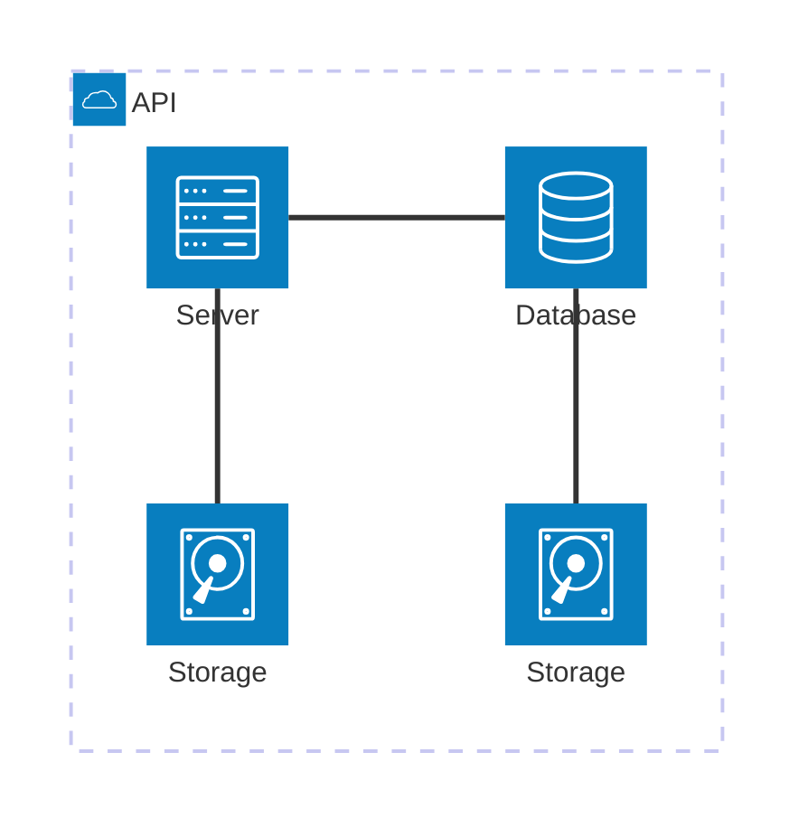
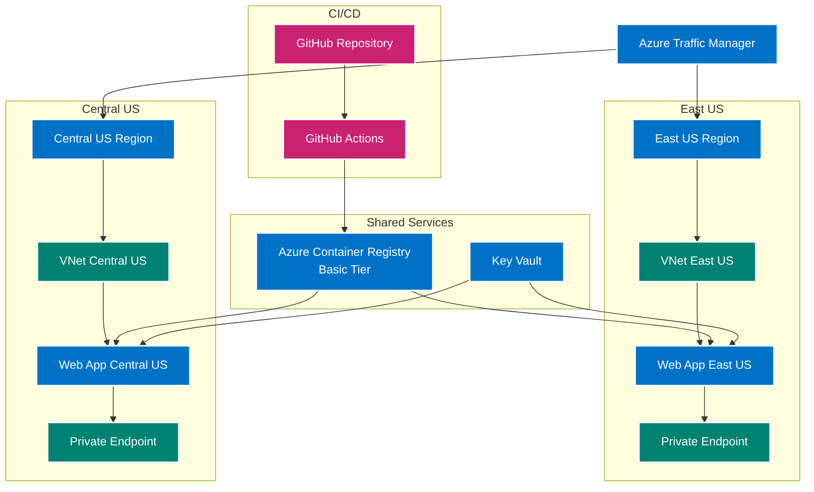

# Basic Multiregion Azure Web App

```mermaid
architecture-beta
    group api(cloud)[API]

    service db(database)[Database] in api
    service disk1(disk)[Storage] in api
    service disk2(disk)[Storage] in api
    service server(server)[Server] in api

    db:L -- R:server
    disk1:T -- B:server
    disk2:T -- B:db
```

```mermaid
graph TB
    TM[Azure Traffic Manager] --> EUS[East US Region]
    TM --> CUS[Central US Region]
    
    subgraph "East US"
    EUS --> EUSVNET[VNet East US]
    EUSVNET --> EUSWEBAPP[Web App East US]
    EUSWEBAPP --> EUSPE[Private Endpoint]
    end
    
    subgraph "Central US"
    CUS --> CUSVNET[VNet Central US]
    CUSVNET --> CUSWEBAPP[Web App Central US]
    CUSWEBAPP --> CUSPE[Private Endpoint]
    end
    
    subgraph "Shared Services"
    ACR[Azure Container Registry<br>Basic Tier] --> EUSWEBAPP
    ACR --> CUSWEBAPP
    KV[Key Vault] --> EUSWEBAPP
    KV --> CUSWEBAPP
    end
    
    subgraph "CI/CD"
    GH[GitHub Repository] --> GHA[GitHub Actions]
    GHA --> ACR
    end

    classDef azure fill:#0072C6,stroke:#fff,stroke-width:2px,color:#fff
    classDef network fill:#008272,stroke:#fff,stroke-width:2px,color:#fff
    classDef security fill:#CA2171,stroke:#fff,stroke-width:2px,color:#fff
    
    class TM,EUS,CUS,EUSWEBAPP,CUSWEBAPP,ACR,KV azure
    class EUSVNET,CUSVNET,EUSPE,CUSPE network
    class GH,GHA security
```